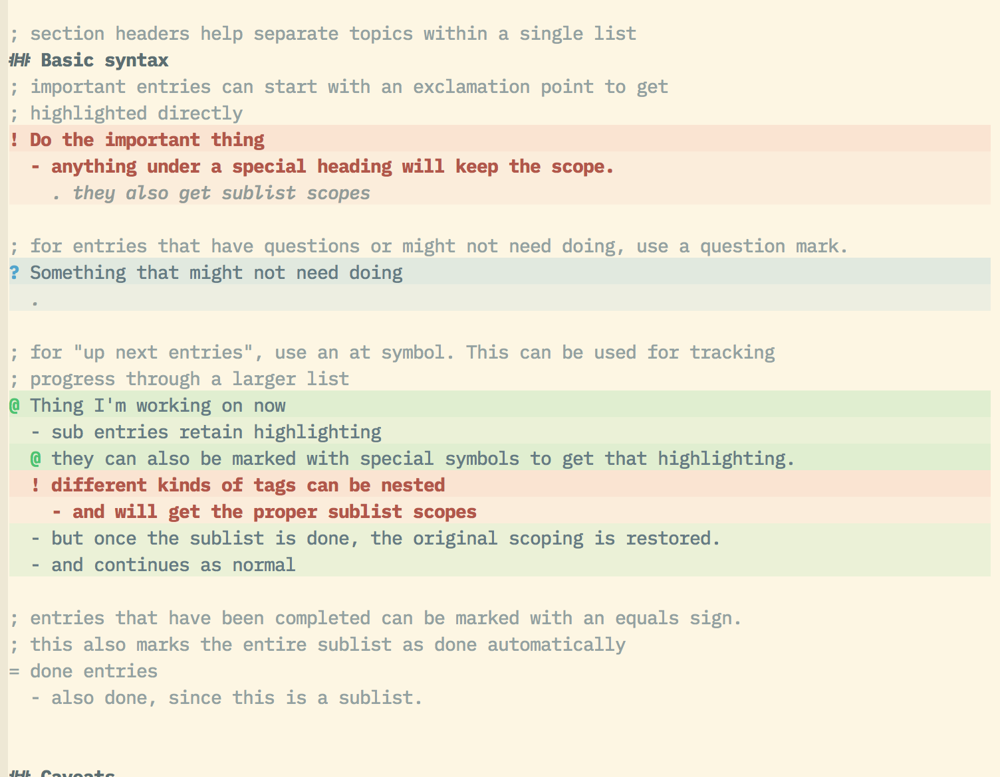

# sublime-todo

A custom sublime syntax for organizing todo lists. Includes section headers, comments, notes, and stateful highlighting of sublists. See `example.todo` for usages.

## Installation

This package has not been published to the main Package Control channel. To install the package, add the repository to Package Control (see the "Add Repository" section at https://packagecontrol.io/docs/usage) with the url [https://github.com/faultyserver/sublime-todo.git].

Once the repository has been added, you should be able to install the package as normal through Package Control. It will be under the name `sublime-todo`.

### Highlighting

For highlighting, you'll need a color scheme that supports the custom scopes defined by this syntax. My own color scheme, [`solar-eyes`](https://github.com/faultyserver/solar-eyes) includes highlighting for these scopes. To make your own highlighting, you can find the `<!-- TODO -->` section of that theme and copy the contents to yours.

## Feature Roadmap

- Keyboard shortcuts to move through the list
- shortcuts to change the type of an entry (important, question, done, etc.)
- Symbol tagging for quick access through the command pallette.
